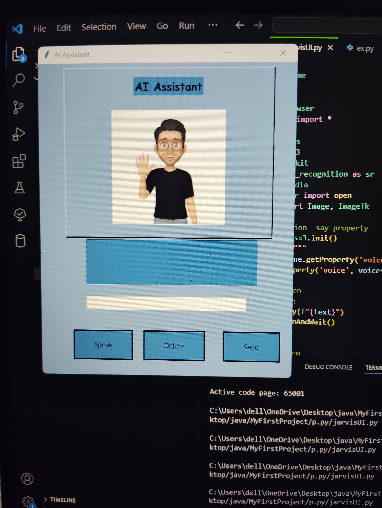

# Jervis-Interactive-Gui

Developed a personalized voice assistant named ”Jarvis” using Python, capable of executing various tasks based on voice commands. The assistant interacts with users, providing functionalities such as web browsing, playing music, opening applications, and more. Tools: Python, Tkinter, pyttsx3, SpeechRecognition, webbrowser, os.

